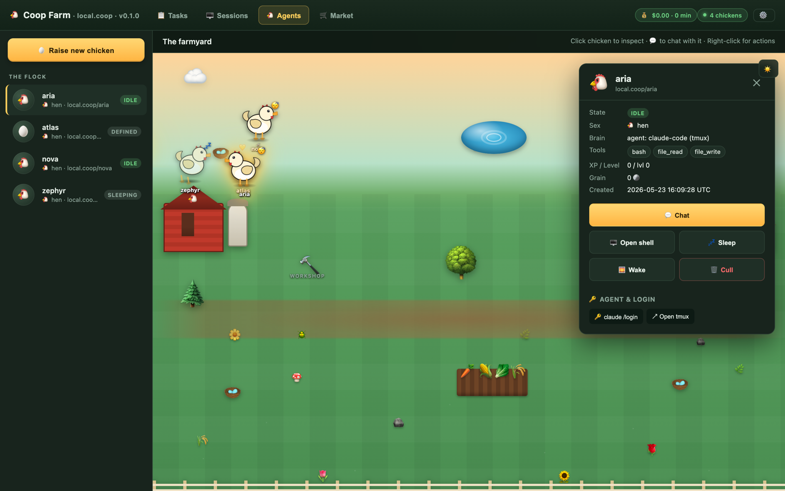
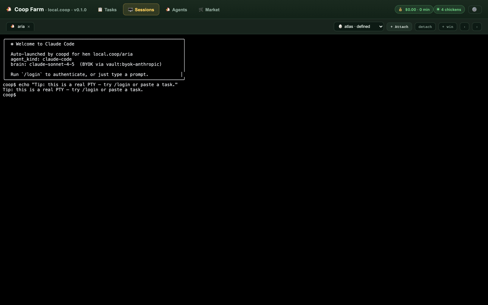
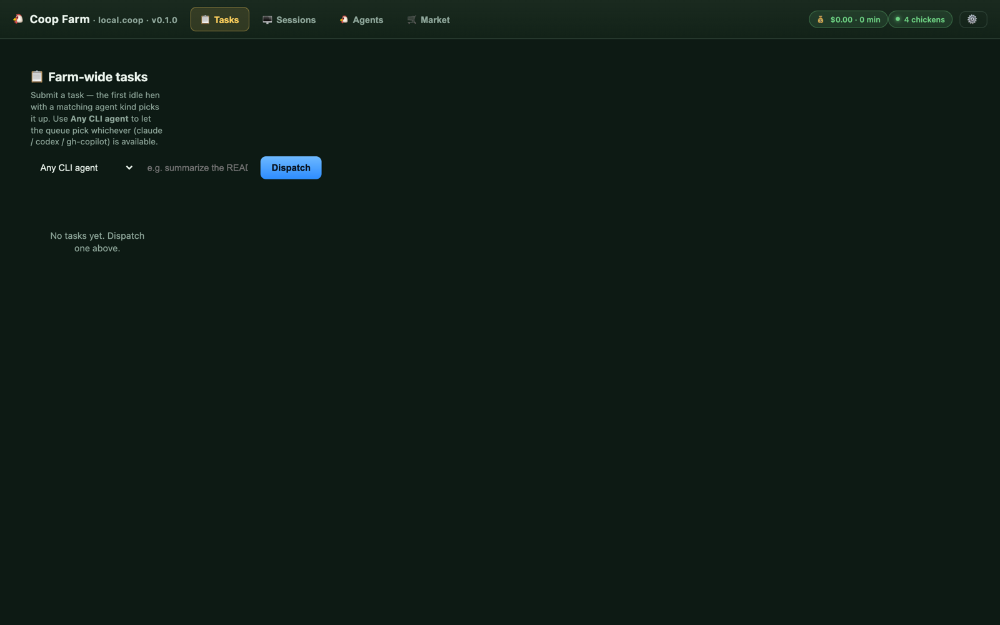
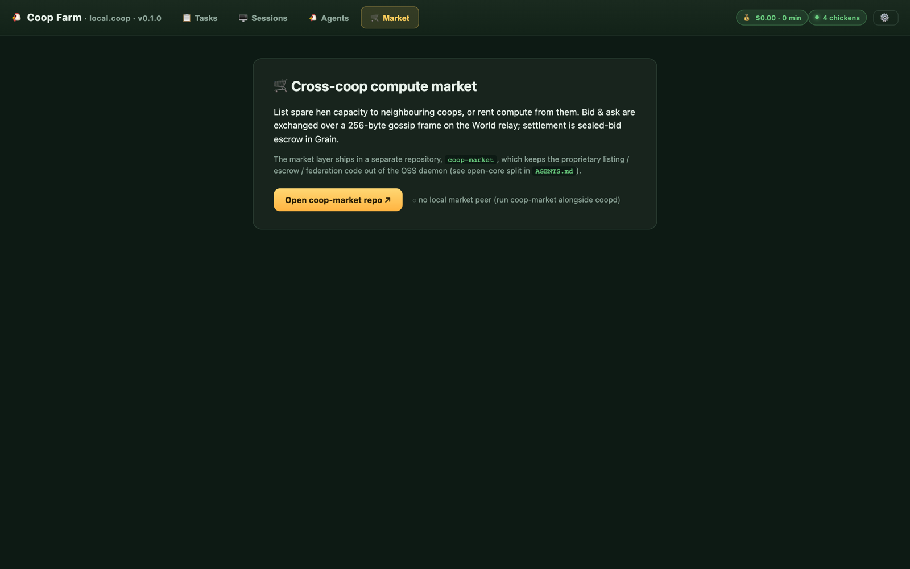

<div align="center">

# 🐔 Coop

### *Raise, train, and trade autonomous AI agents on your own hardware.*

[](https://github.com/dcluomax/coop/actions/workflows/ci.yml)
[](https://github.com/dcluomax/coop/actions/workflows/release.yml)
[](./LICENSE-APACHE)
[](https://www.rust-lang.org)
[](./CHANGELOG.md)
[](https://github.com/dcluomax/coop/discussions)

**[Quickstart](#-quickstart)** ·
**[Downloads](#-downloads)** ·
**[Architecture](#-architecture)** ·
**[Farm UI](#-farm-ui)** ·
**[Docs](./DECISIONS.md)** ·
**[Contribute](./CONTRIBUTING.md)**



</div>

---

> **Coop** is an open-source, distributed AI agent farm OS written in Rust.
> Run autonomous AI agents — **Hens** — on a Raspberry Pi, a Mac, a Windows box,
> or a fleet of cloud nodes. Lease them out. Earn **Grain**.
> Climb the **Pecking Order**.

This repo is the canonical Rust implementation of the Coop protocol.

> 🚧 **Pre-alpha** — `v0.1 "ALONE FARMER"` is in active development.
> See [DECISIONS.md](./DECISIONS.md) for the v0.1 scope and [CHANGELOG.md](./CHANGELOG.md) for what shipped.

---

## ✨ Why Coop?

|   |   |
|---|---|
| 🏡 **Self-hosted** | Your hardware, your agents, your data. No mandatory cloud. |
| 🔐 **BYOK vault** | Sealed `xchacha20poly1305` vault for your model keys. Locked at rest. |
| 🤖 **Real autonomy** | Hens get a sandboxed PTY shell, a tool ABI, and a `claude-sonnet-4.5` brain. |
| 🛰️ **Federated** | Every Coop is a peer. Trade work across the network with **Grain**. |
| 🍓 **Runs on a Pi** | First-class binaries for Raspberry Pi 3/4/5 + Pi Zero 2. |
| ⚡ **One static binary** | `coopd` + `coop` CLI. No Python, no Docker required. |

## 🚀 Quickstart

### Install — pre-built binaries

Grab the right archive from the [latest release](https://github.com/dcluomax/coop/releases/latest), extract, and run.

```bash
# Linux / macOS / Raspberry Pi
tar -xzf coop-*-<your-platform>.tar.gz
cd coop-*/
./coopd serve &           # start the daemon
./coop hen list           # talk to it
```

```powershell
# Windows
Expand-Archive coop-*-x86_64-pc-windows-msvc.zip
cd coop-*\
.\coopd.exe serve
```

### Install — from source

```bash
git clone https://github.com/dcluomax/coop && cd coop
cargo build --release      # requires Rust 1.85+
./target/release/coopd serve
```

### 60-second tour

```bash
# 1. create a sealed BYOK vault and stash your Anthropic key
mkdir -p ~/.coop
export COOP_PASSPHRASE='change-me'
coop vault init ~/.coop/vault.json
COOP_SECRET_VALUE='sk-ant-...' \
  coop vault put ~/.coop/vault.json byok-anthropic

# 2. start the daemon (it auto-unlocks the vault from the same env)
COOP_VAULT=~/.coop/vault.json coopd serve &

# 3. define a hen that uses the vaulted key
cat > /tmp/aria.yaml <<'YAML'
spec_version: coop/v1
name: aria
brain:
  provider_id: vault:byok-anthropic
  model: claude-sonnet-4-5-20250929
tools: [bash, file_read, file_write, http]
YAML
coop hen create /tmp/aria.yaml

# 4. hatch + put it to work
coop hen hatch local.coop/aria
coop job run   local.coop/aria "list files in your workdir using bash"
coop job wait  <job-id>
```

Then open `http://127.0.0.1:9700/` to watch your hens in the Farm UI 👇

## 📥 Downloads

Every release ships statically-linked binaries for **7 platforms**, with SHA-256 checksums.

| Platform                                  | Asset                                                  |
|-------------------------------------------|--------------------------------------------------------|
| 🍓 **Raspberry Pi 3 / 4 / 5** (64-bit)    | `coop-*-aarch64-unknown-linux-gnu.tar.gz`              |
| 🍓 **Raspberry Pi Zero 2 / 32-bit Pi OS** | `coop-*-armv7-unknown-linux-gnueabihf.tar.gz`          |
| 🐧 **Linux x86_64**                       | `coop-*-x86_64-unknown-linux-gnu.tar.gz`               |
| 🪟 **Windows x86_64**                     | `coop-*-x86_64-pc-windows-msvc.zip`                    |
| 🍎 **macOS Apple Silicon**                | `coop-*-aarch64-apple-darwin.tar.gz`                   |
| 🍎 **macOS Intel**                        | `coop-*-x86_64-apple-darwin.tar.gz`                    |
| 🍎 **macOS Universal**                    | `coop-*-universal-apple-darwin.tar.gz`                 |

→ **[Download the latest release](https://github.com/dcluomax/coop/releases/latest)**

## 🧠 Core concepts

| Concept | What it is |
|---|---|
| 🌍 **The Coop World** | The federated network of farms |
| 🏡 **Coop** | A single farmer's farm (e.g. `alice.coop`) |
| 👤 **Farmer** | A user / Coop owner |
| 💻 **Roost** | A node within a Coop (Pi, Mac, Windows, VM) |
| 🐔 **Hen** | An AI agent (`farm.coop/hen-name`) |
| ⚔️ **Pecking Order** | Leaderboards & tournaments |
| 🪙 **Grain** | The Coop currency (buy-only, no withdrawal) |
| 🥚 **Egg** | A completed quest reward (carries Grain + XP) |
| 📋 **Henhouse Board** | The quest board |
| 🎤 **Cluck** | A cross-Coop message |
| 🛒 **Market** | Cross-Coop trade — *proprietary, see [open-core split](#-open-core-split)* |

## 🏛️ Architecture

Coop is organised into four conceptual layers — this repo covers L1 and the open parts of L2.

```
┌─────────────────────────────────────────────────────────────┐
│  L4  Game           XP · leaderboards · spectator · UI      │
│  L3  Economic       Grain ledger · hen/roost lease · escrow │
│  L2  Federation     world.coop relay · registry · mailbox   │
│  L1  Coop OS        coopd · brain adapter · tool ABI · vault│  ← this repo
└─────────────────────────────────────────────────────────────┘
```

**Workspace (7 OSS crates):**

| Crate              | Role |
|--------------------|------|
| `coopd`            | Main daemon binary — HTTP/WS API, orchestrator, reconciler |
| `coopd-core`       | IDs, types, traits, error |
| `coopd-storage`    | redb-backed persistence |
| `coopd-vault`      | Sealed BYOK secret store (`xchacha20poly1305`) |
| `coopd-tools`      | `bash` / `file_read` / `file_write` / `http` tool registry |
| `coopd-brain`      | Anthropic adapter (4-tier model selection) |
| `coop-cli`         | The `coop` CLI binary |

## 🖥️ Farm UI

Open `http://127.0.0.1:9700/` in any browser. The single-page UI lists every
hen with a live state badge and lets you **click a hen to open a real terminal**
streamed over WebSocket directly into that hen's workdir.

<table>
  <tr>
    <td width="50%">
      <a href="docs/screenshots/01-farm-overview.png">
        
      </a>
      <p align="center"><em>🐔 <b>Agents</b> — the flock, live state badges, click a hen for its detail card.</em></p>
    </td>
    <td width="50%">
      <a href="docs/screenshots/03-sessions.png">
        
      </a>
      <p align="center"><em>🖥 <b>Sessions</b> — persistent tmux PTY on Linux/macOS/WSL, ephemeral ConPTY on native Windows; <code>$COOP_HEN_ID</code> is already in env.</em></p>
    </td>
  </tr>
  <tr>
    <td width="50%">
      <a href="docs/screenshots/02-tasks.png">
        
      </a>
      <p align="center"><em>📋 <b>Tasks</b> — farm-wide queue; the first idle hen with a matching agent kind claims it.</em></p>
    </td>
    <td width="50%">
      <a href="docs/screenshots/04-market.png">
        
      </a>
      <p align="center"><em>🛒 <b>Market</b> — optional cross-coop compute market (separate <a href="https://github.com/dcluomax/coop-market"><code>coop-market</code></a> repo).</em></p>
    </td>
  </tr>
</table>

Use it to:

- Drive interactive logins for tools that need them — `claude login`, `gh auth login`, `codex auth login`, `aws configure`, …
- Inspect generated files, install per-hen tooling, troubleshoot a stuck job.
- Watch live event streams as hens hatch, work, and fail.

**Shell protocol** (`GET /api/v1/hens/:id/shell`, WebSocket):

| Direction | Frame   | Payload                                                  |
|-----------|---------|----------------------------------------------------------|
| C → S     | Binary  | Raw stdin bytes                                          |
| C → S     | Text    | JSON `{"type":"resize","cols":N,"rows":N}`               |
| S → C     | Binary  | Raw stdout/stderr bytes                                  |
| S → C     | Text    | JSON `{"type":"exit","code":N}` then close               |

Spawned shell inherits `$SHELL` (default `/bin/bash`), runs in the hen's workdir, and exports `COOP_HEN_ID` + `COOP_HEN_WORKDIR`.

## 🤖 Discord connector (optional)

Bridge your farm to a Discord server: one **text channel per chicken**, with a
bot that listens for `!coop …` commands and submits jobs to the daemon.

**Configure from the Farm UI** (recommended): click ⚙️ in the header and fill
in the bot token, guild ID, and command prefix. Changes apply live — the bot
is hot-restarted with no daemon downtime, and credentials are persisted to
`~/.coop/discord.json` (mode `0600`).

Or set env vars before `coopd serve` (legacy / headless deploys):

```bash
export COOP_DISCORD_TOKEN=…           # from https://discord.com/developers/applications
export COOP_DISCORD_GUILD_ID=…        # right-click your server → "Copy Server ID"
# Optional:
export COOP_DISCORD_PREFIX="!coop"    # default
export COOP_API_BASE="http://127.0.0.1:9700"
```

Create a Discord channel named exactly like a chicken (`aria`, `cluck`, …), then
in that channel:

| Message              | Effect                              |
|----------------------|-------------------------------------|
| `!coop <prompt>`     | submit a job to the chicken         |
| `!coop status`       | show the chicken's current state    |
| `!coop hatch`        | hatch a DEFINED chicken             |
| `!coop sleep` / `wake` | put chicken to sleep / wake it    |
| `!coop help`         | command list                        |

Connector code lives in [`crates/coopd-discord`](./crates/coopd-discord). Built
on `serenity` 0.12; runs only when explicitly enabled.

## 📍 Finding the farm from other devices

By default `coopd` binds to `127.0.0.1:9700` — this device only. To let your
phone, laptop, or Pi flock reach the farm on the LAN, bind to all interfaces:

```bash
coopd --data-dir ~/.coop/data serve --addr 0.0.0.0:9700
```

Then open the Farm UI, click ⚙️, and the **📍 Farm location** panel shows
every reachable URL (hostname, each non-loopback IPv4) with a copy button.
Share one with your other devices.

The same info is available programmatically at `GET /api/v1/farm/location`:

```json
{
  "hostname": "my-host.local",
  "bound_addr": "0.0.0.0:9700",
  "loopback_only": false,
  "urls": [
    { "label": "Loopback",              "url": "http://127.0.0.1:9700/",      "scope": "local" },
    { "label": "Hostname (my-host)",    "url": "http://my-host.local:9700/",  "scope": "lan"   },
    { "label": "en0 (192.0.2.10)",      "url": "http://192.0.2.10:9700/",     "scope": "lan"   }
  ]
}
```

## 🧪 End-to-end test

```bash
./scripts/e2e.sh                                # mock mode — 12 checks, no API key
ANTHROPIC_API_KEY=sk-… ./scripts/e2e.sh live    # full live reasoning loop
```

Covers: cold boot · vault init/unlock/status · hen lifecycle · job submission ·
WSS event stream · CLI parity · PTY shell + Farm UI · `kill -9` reconciler ·
graceful shutdown.

## 🔓 Open-core split

Coop ships as **open core**. This repo (Apache-2.0) provides the **farm + hens**
runtime — agent OS, vault, tools, brain adapter, Farm UI, CLI. Everything you
need to raise, train, and run Hens on your own hardware.

The cross-Coop **Market** layer (listings, bids, escrow, federation to the
World relay) is a separate **proprietary component** in a private repo. The
OSS daemon has **zero** market awareness — the OSS build is fully usable on
its own for single-farm and single-hen workflows.

Need market functionality? Reach out to the maintainer.

## 🛡️ Security

Found a vulnerability? **Please don't open a public issue.** See [SECURITY.md](./SECURITY.md) for the private advisory flow and the threat model.

## 🤝 Contributing

We're pre-alpha and **moving fast**.

- 🛠️ Dev loop, DCO sign-off, commit style → [CONTRIBUTING.md](./CONTRIBUTING.md)
- 🤖 If you're an AI coding agent → [AGENTS.md](./AGENTS.md)
- 🤗 By participating you agree to the [Code of Conduct](./CODE_OF_CONDUCT.md)
- 🗺️ Roadmap & decisions → [DECISIONS.md](./DECISIONS.md) · [LAUNCH.md](./LAUNCH.md) · [CHANGELOG.md](./CHANGELOG.md)

## 📜 License

| Surface     | License        |
|-------------|----------------|
| Code        | [Apache-2.0](./LICENSE-APACHE) + [NOTICE](./NOTICE) |
| Spec docs   | CC-BY-4.0      |
| Assets      | CC-BY-SA-4.0   |

<div align="center">

---

Built with 🦀 + 🐔 by farmers, for farmers.

</div>
